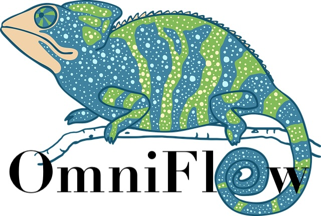

# OmniFlow



OmniFlow is a library designed in [Kotlin][kotlin] to support the process of defining and deploying workflows across 
multiple cloud providers. Developers can easily create workflows along with their corresponding steps, and metadata, 
using a dedicated [Domain-Specific Language][dsl] (DSL). The primary goal is to abstract the details of workflow 
definition and deployment, enabling a seamless translation of workflows across different cloud providers, without the 
need to get familiarized with the schemas of each provider.

This project was developed as part of the Master's thesis in Computer Science and Engineering at the [Instituto Superior
de Engenharia de Lisboa (ISEL)][isel], entitled "Function Composition in Function-as-a-Service Platforms". The project
was advised by Professors Filipe Freitas and José Simão, and developed by Bernardo Costa.

## How to Build

```shell script
./mvnw clean package
```

## How to Test

```shell script
./mvnw clean test
```

## How to Benchmark

To run the benchmarks successfully it is required the following environment variables:
* `AWS_ROLE_ARN`: Amazon Resource Name format
* `AWS_REGION`: Region
* `GOOGLE_PROJECT_ID`: Globally unique identifier for your project
* `GOOGLE_ZONE`: Zone
* `GOOGLE_SERVICE_ACCOUNT`: Service account principals

```shell script
java -jar /benchmarks/target/benchmarks.jar <path-to-txt-file> 
```

## How to Use

Maven Dependency:

```xml
<dependency>
    <groupId>costaber.com.github</groupId>
    <artifactId>omni-flow-deployment</artifactId>
    <version>${omni-flow-deployment.version}</version>
</dependency>
```

### Workflow Definition

A workflow has a generic architecture, necessitating only a few essential components: a `name`, a `description`, an 
`input`, and a `result`. The `name` and `description` serve descriptive purposes, while the `input` designates the 
variable name where the execution arguments will be stored. The `steps` component encompasses the set of instructions 
that specify the workflow's behaviour, and the `result` denotes the variable where the workflow's output will be stored. 
Upon assigning a workflow to a variable, a Workflow model object is promptly created and allocated to the variable.

```kotlin
workflow {
    name("workflow-name")
    description("Workflow Description")
    params("args")
    steps(/** The workflow steps **/)
    result("workflow-result")
}
```

The basic unit in this architecture is the Step, which, as the name suggests, represents a data processing unit with a 
small objective, such as incrementing a number by one. A Step is composed by metadata, such as `name` (identifier) and 
`description`, are string fields without restrictions. The `context` of a step corresponds to the step behaviour, for 
example, make HTTP requests, assign variables, and use conditions like if-else, or when Kotlin expressions. All the 
fields are mandatory. Currently, is supported by three types of contexts: `Assign`, `Call`, and `Conditional`.

```kotlin
step {
    name("call-step")
    description("Make request to example API")
    context(/** The step behavior **/)
}
```

#### Call Step

To initiate an HTTP request to an API or cloud function with specific requirements, the `Call Step` must be defined.
The `Call step` stands out as the most extensive, featuring a vast set of fields and meticulous details. Given its 
coupling with the HTTP protocol, this step type necessitates a broad set of specifications. The `method` parameter is 
determined by the HttpMethod enumerator, covering all the HTTP methods, including `GET`, `POST`, `DELETE`, `PUT`, and 
more. `Host` and `path`, both are string-based fields, with no restrictions. The `authentication` field contains a type,
scope, scopes, and audience, each of which is expressed as a string. `Body` declaration can take either a string or an 
object. `Headers` and `queries`, are maps composed of multiple key-value pairs, where the key represents the header or 
query name, and the value is the header value. `TimeoutInSeconds` is an integer field specifying the timeout duration of
the request. Finally, the `result` denotes the variable name wherein the response will be stored. The `method`, `host` 
and `path`, and `result` parameters are mandatory, as the `HTTP` protocol needs them to provide the request, while the 
other parameters are optional.

```kotlin
step {
    name("call-step")
    description("Make HTTP request to API")
    context(
        call {
            method(HttpMethod.POST)
            host("example-api.com")
            path("/default/v1/")
            authentication(
                type("OAuth2")
            )
            body("Hello World!")
            header(
                "Content-Type" to "application/json"
            )
            query(
                "filter" to value("name")
            )
            timeoutInSeconds(5)
            result("sumResult")
        }
    )
}
```

#### Assign Step

To facilitate variable assignments, the `Assign` context proves to be both intuitive and straightforward, as it 
exclusively deals with variable assignment and creation. Defining a variable is by calling the method `variable`, 
composed of a variable name, `equal` expression, and a value. The assigned value can take on all the Kotlin primitive 
data types, allowing you to leverage Kotlin's capabilities to generate values, for instance, you can employ constants 
like `Random.nextInt()`. The equals expression, an infix method in Kotlin, combines the left and right values – the 
variable name and the assigned value – into a Pair object, offering a highly declarative approach.

```kotlin
step {
    name("assign-step")
    description("Initialize variables")
    context(
        assign {
            variable("number" equal Random().nextInt())
            variable("text" equal "Hello World!")
            variable("isOk" equal true)
        }
    )
}
```

#### Condition Step

The `Switch` step shares similarities with [when][kotlin-when] statement in the Kotlin programming language, allowing you to 
create multiple conditional branches. This step comprises a set of conditions, and a `default` branch, which gets 
executed if none of the conditions are met. Each condition consists of a binary expression used for matching, when is 
matched, the step name specified in the `jump` field, will be executed next. A binary expression encloses a variable, a
binary operator, and a constant value. Supported binary operators include `equalTo`, `notEqualTo`, `greaterThan`, 
`greaterThanOrEqual`, `lessThan`, and `lessThanOrEqual`.

```kotlin
step {
    name("condition-step")
    description("condition")
    context(
        switch {
            conditions(
                condition {
                    match(variable("c") equalTo value(0))
                    jump("Assign1ToC")
                },
                condition {
                    match(variable("c") greaterThan value(0))
                    jump("DivWithC")
                }
            )
            default("Assign1ToC")
        }
    )
}
```

### Cloud Provider Deployment

Once the workflow is defined, the next phase is deploying it to the chosen cloud provider. The supported cloud providers
include Amazon's State Machines and Google's Cloud Workflows, each with its unique set of parameters and credential 
requirements. To successfully complete the deployment phase, is required to create a deployment context tailored to the
cloud provider's specific needs. The deployment services necessitate two primary inputs: the deployment context, and the
predefined workflow. It is important to note that while both cloud providers have their distinct deployment
prerequisites, the workflow to be deployed remains the same - the Workflow model previously crafted using the DSL.

#### Google Cloud Platform

Google's deployment prerequisites encompass various aspects of Google's project, and service account to which the 
workflow will be linked to. It is required to specify essential details, such as, the workflow's identifier, description
, labels, and zone. It is decisive to note that running this piece of code necessitates user credentials to authenticate 
the user's identity and verify access to the specified project and service account. To provide this proof, the 
environment variable`GOOGLE_APPLICATION_CREDENTIALS` must be set, which should point to the location of a credential 
JSON file. This JSON file can take one of two forms: a credential configuration file for workload identity federation or
a service account key. It is also worth mentioning that Google's Application Default Credentials strategy is employed by
their authentication libraries to automatically locate the appropriate credentials based on the application environment, 
simplifying the authentication process.

```kotlin
val googleDeployContext = GoogleDeployContext(
    workflowId = "<workflow-id>",
    workflowDescription = "<workflow-description>",
    workflowLabels = mapOf(
        "environment" to "testing",
        "app" to "omni-flow",
    ),
    projectId = "<your-project-id>",
    serviceAccount = "<your-service-account>",
    zone = "<zone>",
)
GoogleCloudDeployer.Builder()
    .build()
    .deploy(workflow, googleDeployContext)
```

#### Amazon Web Services

Deploying to Amazon follows a similar process to Google's. It entails specifying the State Machine name, the ARN role, 
the region, and optionally, tags. Just like Google, Amazon requires authentication credentials to be defined via 
environment variables: `AWS_ACCESS_KEY_ID`, `AWS_SECRET_ACCESS_KEY`, and `AWS_SESSION_TOKEN`. During Amazon's deployment 
phase, it attempts to load the credentials provider from these environment variables. These credentials are 
cryptographically signed and issued by AWS for secure authentication.

```kotlin
val amazonDeployContext = AmazonDeployContext(
    stateMachineName = "<state-machine-name>",
    roleArn = "<your-role-arn>",
    tags = mapOf(
        "environment" to "testing",
        "app" to "omni-flow",
    ),
    region = "<zone>",
)
AmazonCloudDeployer.Builder()
    .build()
    .deploy(workflow, amazonDeployContext)
```

## Additional Documentations

Please refer to the following documents if you need more details on the tools and frameworks used by this application.

[AWS Step Functions][aws-step-functions]

[AWS Credentials Provider][aws-credentials-provider]

[Google Cloud Workflow][google-cloud-workflows]

[Google Cloud Application Default Credentials][google-cloud-adc]

[kotlin]: https://kotlinlang.org/
[kotlin-when]: https://kotlinlang.org/docs/control-flow.html#when-expression
[dsl]: https://www.jetbrains.com/mps/concepts/domain-specific-languages/
[aws-step-functions]: https://aws.amazon.com/step-functions
[aws-credentials-provider]: https://docs.aws.amazon.com/sdk-for-kotlin/latest/developer-guide/credential-providers.html
[google-cloud-workflows]: https://cloud.google.com/workflows
[google-cloud-adc]: https://cloud.google.com/docs/authentication/application-default-credentials
[isel]: https://www.isel.pt/en/curso/masters-degree/master-computer-science-and-engineering
